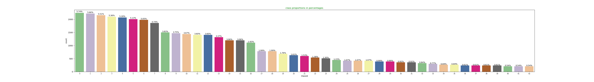
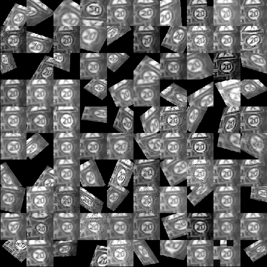

# Traffic-Signs-Image-Classification-with-Deep-ConvNets-Multi-Processing-and-Transfer-Learning.
Image classification algorithm, using Deep Convolutional Neural Networks, Multi-Processing and Transfer-Learning to differentiate between street signs automatically. Achieved 97% accuracy on the test set.

